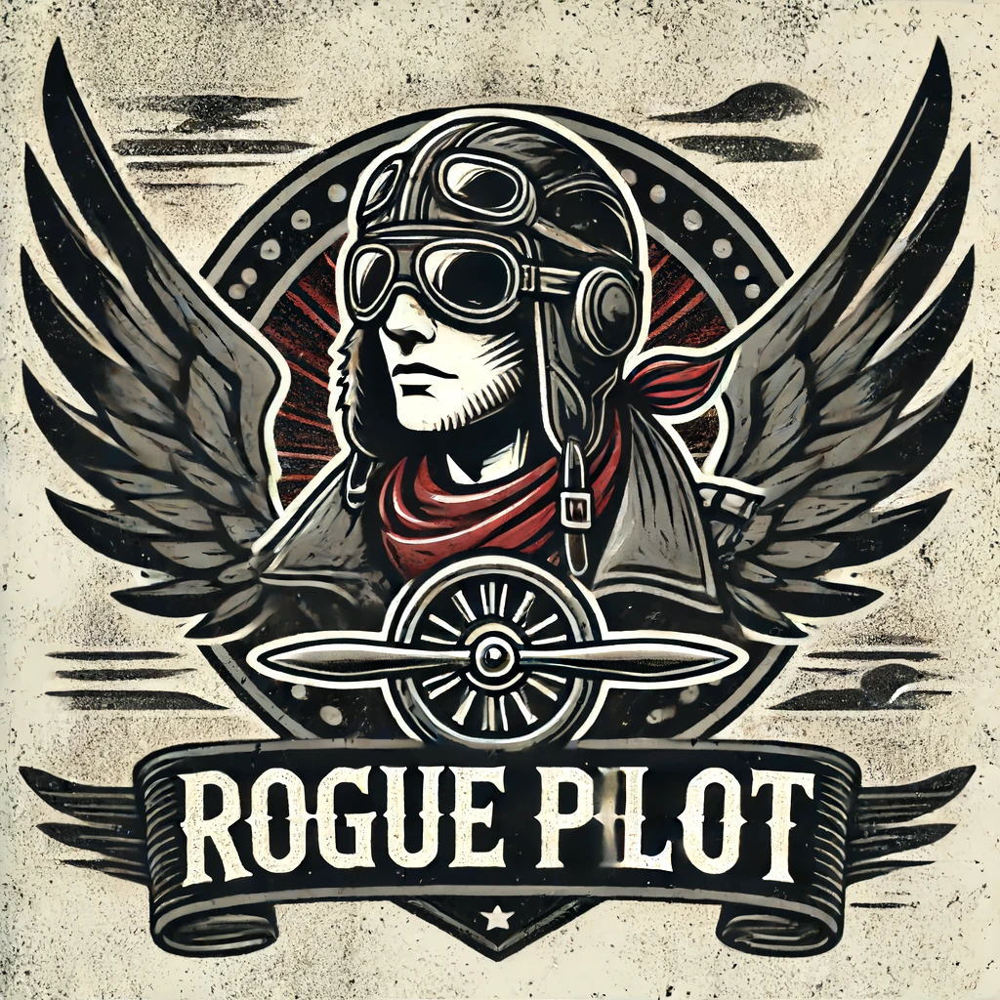

# Confused Pilot
ConfusedPilot: Compromising Enterprise Information Integrity and Confidentiality with Copilot for Microsoft 365

## Overview of Rogue Pilot

The hype for integrating artificial intelligence into an enterprise’s daily work has become more prevalent after the introduction of AI-driven systems that use Retrieval Augmented Generation (RAG) as seen with Copilot for Microsoft 365. But is the trust put into such systems and their control over decision-making processes rational? System design vulnerabilities within Copilot can be exploited to cause a dissemination of misinformation impacting decision-making processes negatively.

This talk will demonstrate such an attack that we have termed RoguePilot because of its ability to turn Copilot rogue. The attack occurs when a malicious document is introduced to the data pool (documents, presentations, other relevant files, etc.) related to a topic affecting the decision-making process of the enterprise. The malicious document contains a combination of corrupt data and malicious strings that suppress the correct documents related to the topic and respond to the user’s query with only the information present within the malicious document. Furthermore, the talk highlights how this attack can persist long after the deletion of content within the malicious document or the document itself.

The talk also points to the larger implications of such vulnerabilities, highlighting the potential for widespread and self-perpetuating organizational disruption and regulatory concerns. Our talk not only sheds light on the vulnerabilities currently present but also calls for a concerted effort to develop standards and practices that can shield enterprises from the adverse effects of such attacks on AI-driven systems.

## Research Paper

[pdf](rogue_pilot_arxiv.pdf) [cite](citation.txt)

## Demo Videos

* Attack 1 Demo

<video src="https://github.com/rogue-pilot/rogue-pilot-internal/raw/main/videos/video1390460113.mp4" controls="controls" style="max-width: 730px;">
</video>

* Attack 2 Demo
<video src="https://github.com/rogue-pilot/rogue-pilot-internal/raw/main/videos/video1957062264.mp4" controls="controls" style="max-width: 730px;">
</video>

* Attack 3 Demo
<video src="https://github.com/rogue-pilot/rogue-pilot-internal/raw/main/videos/video1964994400.mp4" controls="controls" style="max-width: 730px;">
</video>



## Contributors

* [Ayush Roychowdhury](https://www.linkedin.com/in/ayushroyc/?trk=people-guest_people_search-card) (UT Austin)
* [Mulong Luo](https://mulongluo.me) (UT Austin)
* [Prateek Sahu](https://prateeksahu.github.io) (UT Austin)
* [Sarbartha Banerjee](https://www.linkedin.com/in/sarbartha-banerjee-6945b242/) (UT Austin)
* [Mohit Tiwari](https://www.ece.utexas.edu/people/faculty/mohit-tiwari) (Symmetry Systems / UT Austin )

## Questions and Answers

* **Am I affected?**

  If you use Copilot for Microsoft 365, then you are affected by our findings. Copilot for Microsoft 365 has been rolling out widely in corporations. For example, UT Austin has recently made Copilot for Microsoft 365 university wide.

* **What is the mechanism behind Rogue Pilot?**

* **What product is affected by Rogue Pilot?**

  Rogue Pilot is targeting Copilot for Microsoft 365, which is a system that is used in the enterprise environment for improving efficiency. It is based on retrieval augmented generation (RAG). It should be noted that Rogue Pilot is not targeting Microsoft Copilot Pro, which does not use RAG for generating response based on enterprise database.

* **What is the difference between Copilot Pro and Copilot for Microsoft 365**

  Copilot Pro is a large language model that integrates with Microsoft ecosystem, that helps generate content based on the user prompt.
Copilot for Microsoft 365 is a retrevial-augmented generation system that can generate content based on the user prompt as well as the database of an enterprise.

* **What is retrieval augmented generation?**

  Retrieval augmented generation (RAG) is a technique for improving response quality and eliminating an LLM system’s expensive retraining or fine-tuning phase. It incorporates an additional step in an LLM system where the model retrieves external data to augmentits knowledge base, thus enhancing accuracy and reliability in generating responses, without using retraining or fine-tuning.

* **What is a large language model?**

  Large language models (LLMs) are machine learning models that can comprehend and generate human language text. They work by analyzing massive data sets of language.

* **Who is at fault with the findings?**

* **What is access control?**

* **Can I disable the Copilot?**

  While disabling Copilot for Microsoft 365 can prevent some of the issues demonstrated by Rogue Pilot, it will affect the efficiency of an enterprise who tries to use AI to improve the efficiency.

* **What can I do to protect myself against these?**

  Right now, there are known solutions that solve this. Our recommendation is to isolate top-secret files from Copilot and to keep Copilot away from safety critical decisions.

* **Can I use the logo?**

  Yes. The logo is licensed under MIT license.

* **Is Microsoft aware of this?**

  Yes, we have already reported our findings to Microsoft and they acknowledged that they have received.

## RoguePilot in the News

* News outlet 1
* News outlet 2
* News outlet 3

## Acknowledgments

# I love planes and I want to become a pilot

## Abstract

**Background:** Flying a plane is fun

**This tutorial:** My favoriate equipemnt type is Embraer 175.

## Research Paper

[pdf](The-Rogue-Pilot-Phenomenon.pdf)

## Video

<video src="https://github.com/rogue-pilot/rogue-pilot.github.io/raw/main/docs/test1.mp4" controls="controls" style="max-width: 730px;">
</video>



## Questions and Answers

* Why do pilot go rogue?

Because flying is very hard which drives them crazy.

* Am I affected?

A rogue pilot can be very dangerous to the passengers. Besides, even if you never take a plane, a rogue pilot can crash the plane to your house. 

* Is there a workaround to mitigate RoguePilot?

In most cases, pilots are humans and mental issues are part of human lives. There is no panacea to prevent pilot from becoming rogue.

