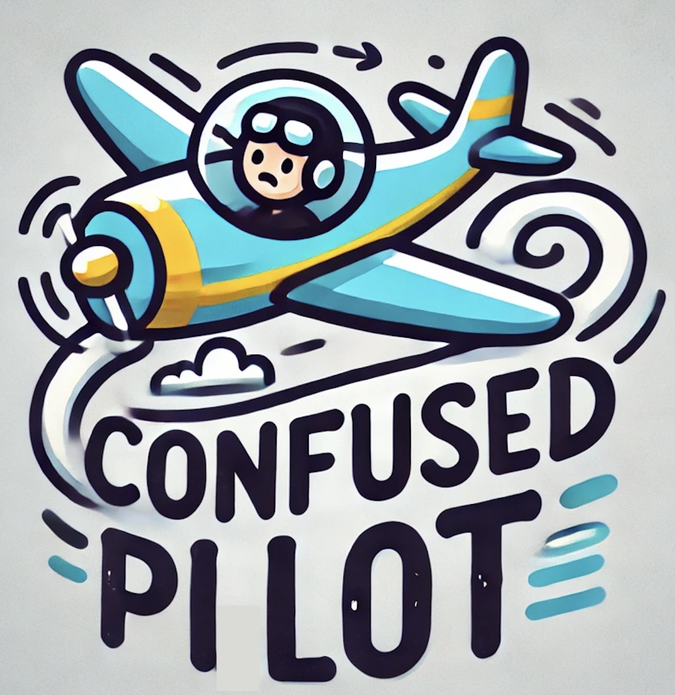

## Overview of ConfusedPilot

The hype for integrating artificial intelligence into an enterprise’s daily work has become more prevalent after introducing AI-driven systems that use Retrieval Augmented Generation (RAG), such as Copilot for Microsoft 365. But is the trust in such systems and their control over decision-making processes within enterprises rational? Copilot and other RAG-based systems can be misused to cause dissemination of misinformation that negatively impacts decision-making processes without proper auditing and safeguarding of data available to large language models in RAG-based systems.

This talk will demonstrate such an attack that we have termed ConfusedPilot because of its ability to turn Copilot into a confused deputy. The attack occurs when a malicious document is introduced to the data pool (documents, presentations, other relevant files, etc.) related to a topic affecting the enterprise’s decision-making process. The malicious document contains a combination of corrupt data and malicious strings that suppress the correct documents related to the topic and respond to the user’s query with only the information present within the malicious document. Furthermore, the talk highlights how this attack can persist after deleting content within the malicious document or the document itself. The talk also points to the larger implications of such attacks, highlighting their cascading effect and existing security measures that can be used to reduce the attack’s effectiveness. Our talk sheds light on the current attacks and potential security measures that can shield enterprises from the adverse effects of such attacks on their AI-driven systems.

## ConfusedPilot is presented at [DEFCON AI Village 2024](https://aivillage.org/events/2024_talks)!

[Paper](https://arxiv.org/abs/2408.04870)

[Presentation](ConfusedPilot_Site.pdf) 

## FAQs

* What is a large language model?

> Large Language Models (LLMs) are machine learning models that analyze, understand, and generate human language text.

* What is retrieval augmented generation?

> Retrieval Augmented Generation (RAG) is a technique for improving response quality and eliminating an LLM system’s expensive retraining or fine-tuning phase. It incorporates an additional step in an LLM system where the model retrieves external data to augment its knowledge base, thus enhancing accuracy and reliability in generating responses, without using retraining or fine-tuning.

* What is access control?

Access control is a security method used to manage who can view or use resources such as data in a computing environment. It ensures that only authorized users can access specific data or systems.

* What is the confused deputy?

The confused deputy is a security problem where a program with higher privileges is tricked into misusing those privileges by a less privileged user, often leading to unintended actions or access.

* What is an insider threat?

An insider threat is a risk posed by individuals within an organization who misuse their access to sensitive information or systems, either intentionally or accidentally, to harm the organization.

* What is the difference between Copilot Pro and Copilot for Microsoft 365?

Copilot is an LLM that can integrate within your Microsoft ecosystem and be used as an AI assistant that generates content based on user prompts. Copilot for Microsoft 365 is a RAG-based system that can generate content based on the user prompt as well as resources shared and owned by the user within their enterprise.

* What is Confused Pilot targeting?

Confused Pilot has two victims. The first victim is the LLM within the RAG-based system, in our case, Copilot. By introducing misinformation with malicious strings that read like instructions, the insider threat is able to confuse the LLM into disregarding other content that is present and also attribute the misinformation to some other user besides the insider threat. The second victim is the person receiving the response from the LLM. The insider threat has no control over the modification of someone else’s prompt to affect their generated response, so they have to use a retrieval mechanism within the RAG-based system to do it for them!

* Is Confused Pilot a Copilot for Microsoft 365 vulnerability?

Confused Pilot was used in Copilot for Microsoft 365 for the sake of presentation and paper; however, this is not a Copilot for Microsoft 365 problem only. This problem has been observed in other RAG-based systems that use LLAMA, Vicuna, and OpenAI. The main culprit of this problem is misuse of RAG-based systems such as Copilot for Microsoft 365, via improper setup of access control and data security mechanisms.

* How is Confused Pilot different from a poisoning attack?

At its core, Confused Pilot depends on the fact that data within the enterprise is poisoned by an insider threat. However, as seen in the demos, attribution and its ability to cross over into metadata provided by Copilot’s response adds non-repudiability and erasure of traceability to the mix.

* Am I affected by Confused Pilot?

It depends. This is a data security problem affecting RAG-based systems within enterprises with insider threats. If you are using Copilot for Microsoft 365 or other RAG-based systems without proper data security measures implemented, such as access control and data auditing, then you might be affected by our findings. Proper data security measures include, but are not limited to, applying Prompt Shields to Copilot, segmenting present data, auditing and verifying present data, and tagging insider threats as noted by our “Lasso of Defense” (slides 50-55 in the Confused Pilot Presentation).

* As someone whose enterprise uses Copilot for Microsoft 365 or some other RAG-based system, what should I do?

Ensure that your RAG-based system has prompt security similar to the Azure AI content tool Prompt Shields. Make use of Purview’s capabilities such as Segments, Insider Threat Tagging, and AI Hub. And as Copilot and other LLMs always mention, verify generated content and responses.

* Can’t I just segment my data perfectly so that it is impossible for an insider threat to affect it while still allowing business operations to run smoothly?

It's up to you! But we should warn you that other data security experts have been trying to solve this problem for ages. Copilot or not, creating a perfect access control hierarchy within your enterprise is tough, to say the least.

## Contributors

<table>
  <tr>
    <td style="vertical-align: top; text-align: left; padding-right: 10px;">
      
    </td>
    <td style="vertical-align: top; text-align: left;">
      <strong><a href="https://www.linkedin.com/in/ayushroyc/?trk=people-guest_people_search-card">Ayush Roychowdhury</a></strong> (UT Austin) 
      Ayush RoyChowdhury is an incoming master student at the Chandra Department of Electrical and Computer Engineering at the University of Texas Austin. His research interests include language model security, data security, and explainable artificial intelligence for security.
    </td>
  </tr>
  <tr>
    <td style="vertical-align: top; text-align: left; padding-right: 10px;">
      
    </td>
    <td style="vertical-align: top; text-align: left;">
      <strong><a href="https://mulongluo.me">Mulong Luo</a></strong> (UT Austin) 
      Mulong Luo is currently a postdoctoral researcher at the University of Texas at Austin. His research interests are in computer architecture, side channel, and machine learning. He won best paper award at CPS-SPC workshop. He got his Ph.D. from Cornell University in 2023.
    </td>
  </tr>
  <tr>
    <td style="vertical-align: top; text-align: left; padding-right: 10px;">
      
    </td>
    <td style="vertical-align: top; text-align: left;">
      <strong><a href="https://prateeksahu.github.io">Prateek Sahu</a></strong> (UT Austin) 
      Prateek Sahu is currently a Ph.D. student at the University of Texas at Austin. His research interests are microservices, service mesh, cloud computing, function-as-a-service measurement.
    </td>
  </tr>
  <tr>
    <td style="vertical-align: top; text-align: left; padding-right: 10px;">
      
    </td>
    <td style="vertical-align: top; text-align: left;">
      <strong><a href="https://sites.google.com/view/sarbartha/bio">Sarbartha Banerjee</a></strong> (UT Austin) 
      Sarbartha Banerjee is currently a Ph.D. candidate at the University of Texas at Austin. His research interests are secure accelerators, side channel defense, machine learning security.
    </td>
  </tr>
  <tr>
    <td style="vertical-align: top; text-align: left; padding-right: 10px;">
      
    </td>
    <td style="vertical-align: top; text-align: left;">
      <strong><a href="https://www.ece.utexas.edu/people/faculty/mohit-tiwari">Mohit Tiwari</a></strong> (Symmetry Systems / UT Austin) 
      Mohit Tiwari is an associate professor and he directs the SPARK lab at the University of Texas at Austin. He is also the CEO of Symmetry Systems, Inc. His current research focuses on building secure systems, all the way from hardware to system software to applications that run on them. Prof. Tiwari received a PhD from UC Santa Barbara (2011) and was a post-doctoral fellow at UC Berkeley (2011-13) before joining UT.
    </td>
  </tr>
</table>

## Contact

Please direct questions to [confused-pilot@googlegroups.com](mailto:confused-pilot@googlegroups.com).

