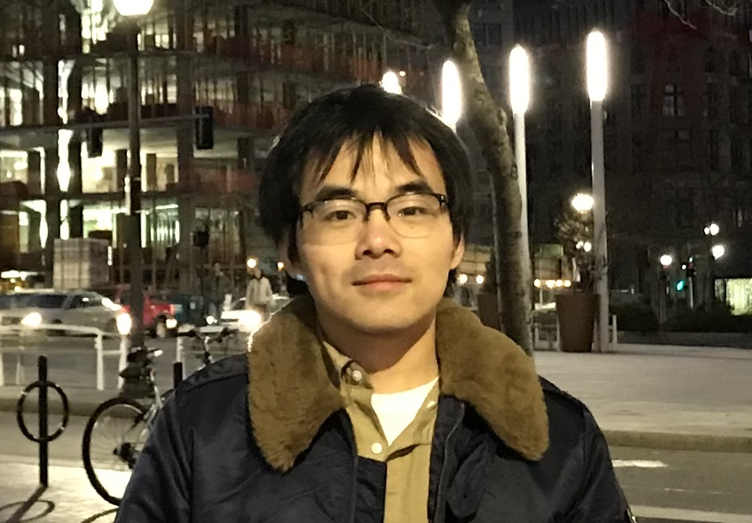
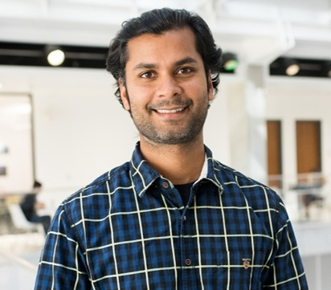

# Tutorial: LDMA: Learning-based Detection of Microarchitectural Attacks

## Abstract

**Background:** attacks can steal critical secret information in computer systems without being noticed. Due to their stealthy and evolving nature where new attacks are continuously being found, existing rule-based detection mechanisms fall short of detecting emerging microarchitectural attacks. Recently, the breakthrough in artificial intelligence has demonstrated superhuman performance in detecting microarchitectural attacks.

**This tutorial:** we aim to systematically introduce machine learning-based microarchitectural attack detection to computer architecture and system researchers. We will first give a general introduction about the microarchitecture attacks, followed by an overview of the machine learning methods typically used for attack detection. Then, we will introduce the current hardware architectures used for ML-based microarchitecture detection. We will also provide a lab for experimenting with ML-based detection algorithms for microarchitectural attacks.  

**Target audience:** The target audience include but not limited to system and architectural security researchers (attending ASPLOS) who are interested in machine learning methods and their applications in architecture and system security, applied machine learning researchers who are exploring new applications of machine learning in system and computer architecture security.

## This tutorial

This tutorial will be held at [ASPLOS 2024](https://www.asplos-conference.org/asplos2024/) in San Diego on Sunday, April 28th, 2024, 1:30pm-5pm at the Hilton La Jolla Torrey Pines. We will also enable livestream by [Zoom](https://utexas.zoom.us/j/99882862923).

### Topics to be Covered

* Microarchitecture attacks including cache side channel attacks
* Machine learning-based attack detection algorithms
* Detection frameworks for microarchitecture attacks

### Tentative Schedule

| Time  | Topic | 
| ------------- | :-------------: | 
|1:30pm-2:10pm|Microarchitecture attacks and defenses|
|2:20pm-3:00pm|Short course on supervised machine learning and reinforcement learning|
|3:00pm-3:30pm|Coffee break|
|3:30pm-4:00pm|Machine learning-based microarchitecture attack detection architecture|
|4:10pm-5:00pm|Mini-lab on reinforcement learning-based microarchitecture attack detection [[docs]](https://github.com/ut-ldma/ut-ldma.github.io)|

## Contact us
For any further questions please contact [Dr. Mulong Luo](https://mulongluo.me) at <mulong@utexas.edu>. 

## Organizer

|  |  Organizer |
| ------------- | :------------- |
|  |**Mulong Luo** is currently a postdoctoral researcher at the University of Texas at Austin. His research interests are in computer architecture, side channel, and machine learning. He is selected as CPS rising star 2023. His work has been shortlisted for Top Picks in Hardware and Embedded Security, and he has also won best paper award at CPS-SPC workshop. He got his Ph.D. from Cornell University in 2023.|
||**Ayush RoyChowdhury** is currently a senior undergrad at the Chandra Department of Electrical and Computer Engineering at the University of Texas Austin. His research interests include language model security, data security, and explainable artificial intelligence for security. |
|  | **Mohit Tiwari** is an associate professor and he directs the SPARK lab at the University of Texas at Austin. His current research focuses on building secure systems, all the way from hardware to system software to applications that run on them. Prof. Tiwari received a PhD from UC Santa Barbara (2011) and was a post-doctoral fellow at UC Berkeley (2011-13) before joining UT.|

 
 
