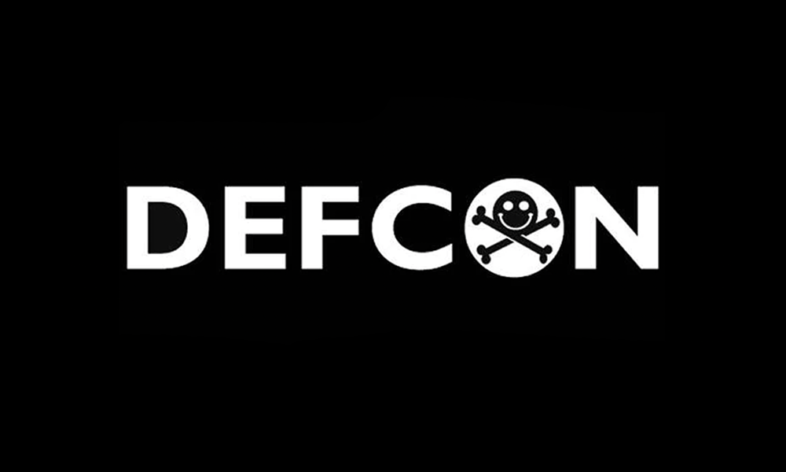

## Overview of ConfusedPilot

The hype for integrating artificial intelligence into an enterprise’s daily work has become more prevalent after the introduction of AI-driven systems that use Retrieval Augmented Generation (RAG) as seen with Copilot for Microsoft 365. But is the trust put into such systems and their control over decision-making processes rational? System design vulnerabilities within Copilot can be exploited to cause a dissemination of misinformation impacting decision-making processes negatively.

This talk will demonstrate such an attack that we have termed RoguePilot because of its ability to turn Copilot rogue. The attack occurs when a malicious document is introduced to the data pool (documents, presentations, other relevant files, etc.) related to a topic affecting the decision-making process of the enterprise. The malicious document contains a combination of corrupt data and malicious strings that suppress the correct documents related to the topic and respond to the user’s query with only the information present within the malicious document. Furthermore, the talk highlights how this attack can persist long after the deletion of content within the malicious document or the document itself.

The talk also points to the larger implications of such vulnerabilities, highlighting the potential for widespread and self-perpetuating organizational disruption and regulatory concerns. Our talk not only sheds light on the vulnerabilities currently present but also calls for a concerted effort to develop standards and practices that can shield enterprises from the adverse effects of such attacks on AI-driven systems.

## Research Paper

[pdf](confused_pilot_arxiv.pdf)
[cite](citation.txt)

## Contributors

* [Ayush Roychowdhury](https://www.linkedin.com/in/ayushroyc/?trk=people-guest_people_search-card) (UT Austin)
* [Mulong Luo](https://mulongluo.me) (UT Austin)
* [Prateek Sahu](https://prateeksahu.github.io) (UT Austin)
* [Sarbartha Banerjee](https://www.linkedin.com/in/sarbartha-banerjee-6945b242/) (UT Austin)
* [Mohit Tiwari](https://www.ece.utexas.edu/people/faculty/mohit-tiwari) (Symmetry Systems / UT Austin )

|  |  About them |
| ------------- | :------------- |
||**Ayush RoyChowdhury** is currently a senior undergrad at the Chandra Department of Electrical and Computer Engineering at the University of Texas Austin. His research interests include language model security, data security, and explainable artificial intelligence for security. |
|  |**Mulong Luo** is currently a postdoctoral researcher at the University of Texas at Austin. His research interests are in computer architecture, side channel, and machine learning. He is selected as CPS rising star 2023. His work has been shortlisted for Top Picks in Hardware and Embedded Security, and he has also won best paper award at CPS-SPC workshop. He got his Ph.D. from Cornell University in 2023.|
|  | **Mohit Tiwari** is an associate professor and he directs the SPARK lab at the University of Texas at Austin. His current research focuses on building secure systems, all the way from hardware to system software to applications that run on them. Prof. Tiwari received a PhD from UC Santa Barbara (2011) and was a post-doctoral fellow at UC Berkeley (2011-13) before joining UT.|

 
 

